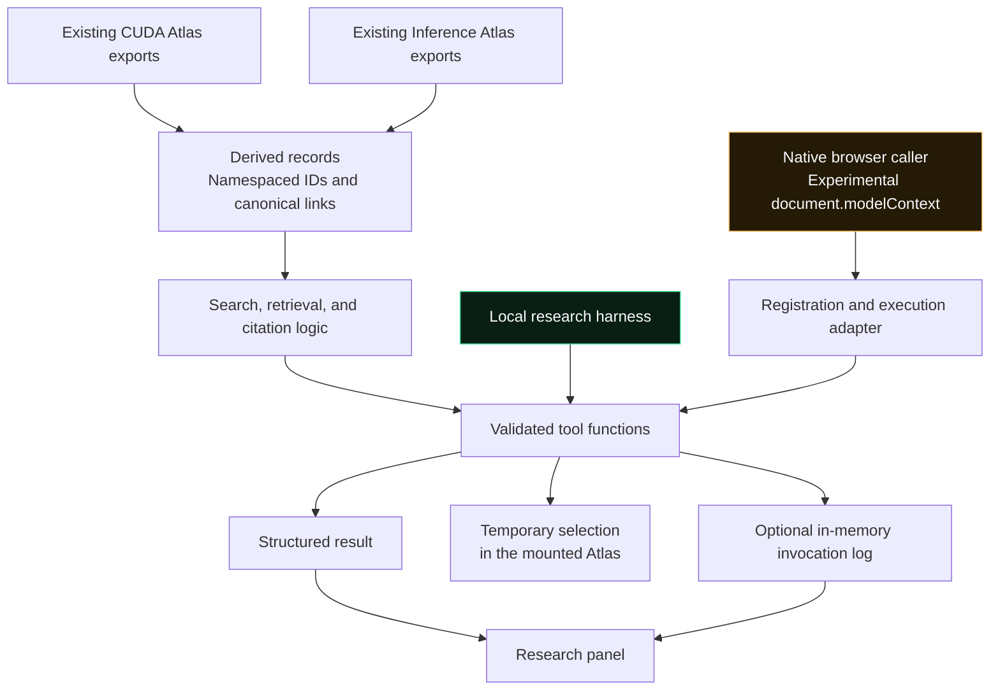

# WebMCP-Edge

[](LICENSE)


[](evaluation/validation.md)
[](docs/release-status.md)

**A website exposing its own content as browser tools: search real CUDA and Inference concepts, retrieve the source record, and produce a citation through explicit application operations.**

A browser agent looking for GPU memory concepts must interpret navigation, open entries, and reconstruct relationships from the rendered page. The website already knows the titles, categories, explanations, and destinations. WebMCP-Edge makes that knowledge available through three declared capabilities over the [AI Engineering Visual Encyclopedia](https://github.com/mailtotanvir/AI-Engineering-Visual-Guide).

The visual Atlas and the tool interface use the same source content. A search can return structured records and highlight a matching entry in the mounted Atlas. Retrieval preserves the original explanation and technical points. Citation uses the actual title and URL, leaving unavailable bibliographic fields missing.

> The application functions and ordinary Chromium harness have been checked. Native WebMCP interoperability and browser-agent performance remain unmeasured. This repository is a private review candidate; the accompanying article is an unapproved draft.

## Why expose the website's own operations?

The experiment asks what happens when a browser caller can request an operation that the application understands, rather than infer that operation from presentation alone.

| Interface question | How this build addresses it |
| --- | --- |
| Where does a result come from? | Records are derived from the encyclopedia's existing CUDA and Inference Atlas exports. |
| How does a caller find a concept? | `search_articles` returns deterministic lexical matches, with stable IDs and canonical links. |
| Can a caller inspect the full record? | `get_article` returns the source-backed record, including available technical points and scene relationships. |
| Can the result be cited without inventing metadata? | `cite_article` renders title-first APA, MLA, or Chicago citations using actual title and URL. |
| Can a human see what a tool selected? | Search and retrieval can reveal a matching entry in the currently mounted Atlas. |
| Can the implementation be checked without native browser support? | An explicitly labeled local harness invokes the application functions directly. |

The application is frontend-only. It needs no model endpoint, API key, database, MCP server, or remote telemetry service. Any agent used for a future comparison is a separate evaluation dependency.

## Architecture



Design choices:

- **Content stays in the application.** The research package distributes an integration patch over a pinned upstream revision. Reproduction fetches the encyclopedia separately.
- **Each record keeps its identity.** IDs such as `cuda:atlas:sms` distinguish world and record type. Canonical links include the source entry ID.
- **Search is inspectable.** Case-insensitive lexical terms score title/domain matches at four points and summary/technical-text matches at one point. Scores are summed, with an ID tie-break. This is OR-style substring matching.
- **The harness and native adapter are separate paths.** Native execution discovers a registered tool object through `document.modelContext` and passes it to the browser's `executeTool`. The harness calls application functions directly; it never installs an imitation native API.
- **Selection changes are disclosed.** Tools preserve source content but may change temporary UI state. The adapter does not assert the draft's `readOnlyHint`, which promises no state modification.
- **Logs stay local.** While the research panel is open, it retains up to 100 calls in memory. Export is explicit, and inputs need review before sharing.

The API target is the WebMCP Draft Community Group Report dated 2 October 2026. It is not a W3C Standard and is not on the Standards Track. Browser implementations may expose a different interface.

## Three tools, one source model

| Tool | Input | Output |
| --- | --- | --- |
| `search_articles` | `{"query":"KV cache","limit":3}` | `results`: IDs, titles, worlds, scene references, summaries, paths, and URLs |
| `get_article` | `{"id":"cuda:atlas:sms"}` | The canonical Streaming Multiprocessors record, preserving available source fields |
| `cite_article` | `{"id":"cuda:atlas:sms","format":"APA"}` | ID, title, format, citation text, URL, and metadata convention |

Search accepts 1–300 characters, defaults to five results, and allows a maximum of ten. Unexpected fields, invalid limits, unknown IDs, and unsupported citation formats are rejected. Missing author and publication dates remain missing: APA uses `n.d.`, MLA omits the unavailable date, and Chicago includes a missing-access-date note.

Results from another world remain available as structured links. Selection synchronization affects only the mounted Atlas; the adapter does not automatically navigate or control simulations.

## A recorded browser check

The ordinary Chromium smoke script opened the CUDA Atlas at `?entry=sms`, checked initial selection, executed a local search, then opened the Inference Atlas and searched for `KV cache`. Both the local production export and the live encyclopedia completed these checks without page errors:

```text
{ nativeContextPresent: false, pageErrors: [] }
```

The record is in [evaluation/browser-smoke.log](evaluation/browser-smoke.log). The result establishes that these ordinary-browser interactions worked in the checked environment. The absence of `document.modelContext` means the run exercised the local harness, not native WebMCP execution.

| Evidence | What it supports | What it does not establish |
| --- | --- | --- |
| [218 tests across 13 suites](evaluation/tests.log), including six WebMCP tests | Source-record contracts, bounded search, malformed-input rejection, deterministic citations, and mocked registration/cancellation behavior | Real native discovery or browser-agent completion |
| TypeScript check and [production build](evaluation/build.log) | Type checking and a GitHub Pages project-subpath static export | Compatibility across experimental browsers |
| [Chromium smoke record](evaluation/browser-smoke.log) | Entry selection and local tool execution on the checked local/live pages | An agent's accuracy, action count, or latency |
| Pinned checkout and patch application | The integration can be reconstructed from the specified source revision | An independently reproduced full evaluation |

See the [validation report](evaluation/validation.md) for check details and limitations. The original local validation used copied dependencies; the upstream deployment workflow subsequently completed its `npm ci`, test, and build steps. Local checkout paths in the logs have been redacted without changing test results.

## Quick start

Requirements: Git, Node.js 20 or later, npm, and access to GitHub and npm. The repository is private, so cloning requires an authorized GitHub account.

```bash
# Clone the research package using your configured GitHub SSH access.
git clone git@github.com:mailtotanvir/WebMCP-Edge.git
cd WebMCP-Edge

# Fetch the pinned encyclopedia and apply the integration patch.
bash scripts/reproduce.sh ../webmcp-review
cd ../webmcp-review

# Install, validate, and run the application.
npm ci
npm test
npx tsc --noEmit
npm run dev
```

Open `http://localhost:3000/atlas/?entry=sms`. Expand **Agent-native web · research mode**, keep **local harness** selected, and execute a search. Select `get_article` or `cite_article` to inspect the corresponding record and citation. Native mode requires a verified browser exposing the matching draft interface.

The reproduction script refuses to overwrite an existing target directory. It uses these fixed revisions:

| Revision | Commit |
| --- | --- |
| Upstream base | `c8c5e2b6195e8f725f0ccba86b2b3d29c16514df` |
| Original integration | `1bf88d7b366475d46a41ccb8bc8bfec51f7bdeb7` |

The [integration manifest](integration/manifest.json) and [design document](docs/webmcp-design.md) describe the implementation boundary.

### Production export and browser smoke check

Build the project-subpath export from the reconstructed encyclopedia checkout:

```bash
NEXT_PUBLIC_BASE_PATH=/AI-Engineering-Visual-Guide npm run build
mkdir -p ../webmcp-preview/AI-Engineering-Visual-Guide
cp -R out/. ../webmcp-preview/AI-Engineering-Visual-Guide/
python3 -m http.server 4173 -d ../webmcp-preview
```

In a second terminal, from the research package checkout:

```bash
# Install evaluation tooling in an ignored local directory.
npm install --prefix .browser-tools playwright
./.browser-tools/node_modules/.bin/playwright install chromium

# Run the ordinary-browser check against the mounted production export.
BASE_URL=http://localhost:4173/AI-Engineering-Visual-Guide \
NODE_PATH="$PWD/.browser-tools/node_modules" \
node scripts/browser-smoke.cjs
```

The configured project path must be present in the preview server's directory structure so the exported assets resolve. The script reports native-context presence but does not run a browser agent.

## Reading the local invocation log

The panel records calls while open and can export `webmcp-local-log.json`:

| Field | Meaning |
| --- | --- |
| `tool`, `input` | Invoked operation and supplied arguments |
| `timestamp`, `durationMs` | Invocation time and application callback duration |
| `success`, `error` | Application result or failure |
| `count` | Result count for searches |
| `mode` | Execution path recorded by the application |

Callback duration is not end-to-end agent latency. Closing the panel stops recording but retains the existing in-memory log until cleared or the page is torn down. Review query text before exporting or committing evidence.

## Research still to run

The [evaluation protocol](evaluation/protocol.md) defines three tasks: find CUDA memory-hierarchy content, find relevant Inference KV-cache/memory concepts, and retrieve Streaming Multiprocessors with an APA citation.

A comparison needs a verified native browser configuration and the same agent/model, content revision, prompts, viewport, and reset policy across ordinary DOM and native-tool conditions. Accepted relevance judgments must be reviewed before measured runs. Discovery counts as an action; internal callback dispatch does not count again. Failures and timeouts must be retained alongside successful runs.

No native or DOM-agent runs have been collected. No latency, action savings, or relevance advantage is claimed.

## Repository map

| Path | Purpose |
| --- | --- |
| [integration/webmcp.patch](integration/webmcp.patch) | Adapter, application functions, panel, Atlas synchronization, and tests as an upstream patch |
| [integration/manifest.json](integration/manifest.json) | Pinned source and implementation revisions |
| [scripts/reproduce.sh](scripts/reproduce.sh) | Prepare a clean integration checkout |
| [scripts/browser-smoke.cjs](scripts/browser-smoke.cjs) | Ordinary Chromium harness check |
| [evaluation/](evaluation/) | Protocol, validation report, and recorded evidence |
| [docs/webmcp-design.md](docs/webmcp-design.md) | Integration design and rollout boundary |
| [docs/privacy-review.md](docs/privacy-review.md) | Sanitization changes, audit scope, and historical exposure limits |
| [docs/release-status.md](docs/release-status.md) | Current private-review and publication gate |
| [blog/](blog/) | Withdrawn article draft and local preview assets |
| [CITATION.cff](CITATION.cff) | Research-package citation metadata |

Preview the article draft from this repository with `python3 -m http.server 4174 -d blog`, then open `http://localhost:4174/`. It requires substantial editorial review before publication.

## Known limitations

- Native interoperability is unmeasured; the draft API and actual browser interface may differ.
- Only CUDA and Inference Atlas records are exposed. Search is lexical, with no semantic model or evaluated relevance guarantee.
- Citation completeness depends on source metadata. Existing references inside an entry are not treated as the entry's authors.
- Runtime schemas constrain arguments but do not authenticate a caller or make page descriptions and content trustworthy. Origin mediation and real browser cleanup remain unverified.
- The ordinary Chromium check covers selected interactions, not a full browser matrix, accessibility audit, or agent evaluation.
- Publication remains gated on owner review. The repository is private and the blog article is withdrawn. Sanitized history cannot guarantee erasure of previously published objects from caches or other clones.

## License and references

Original WebMCP code and research-package material are [MIT licensed](LICENSE). Upstream encyclopedia content, existing source code, patch context, dependencies, and referenced specifications retain their own rights. No upstream repository license was established during preparation. Read [LICENSING.md](LICENSING.md) before redistributing upstream materials.

- [WebMCP draft specification](https://webmachinelearning.github.io/webmcp/)
- [Chrome agent documentation](https://developer.chrome.com/docs/ai/agents)
- [AI Engineering Visual Encyclopedia source](https://github.com/mailtotanvir/AI-Engineering-Visual-Guide)
